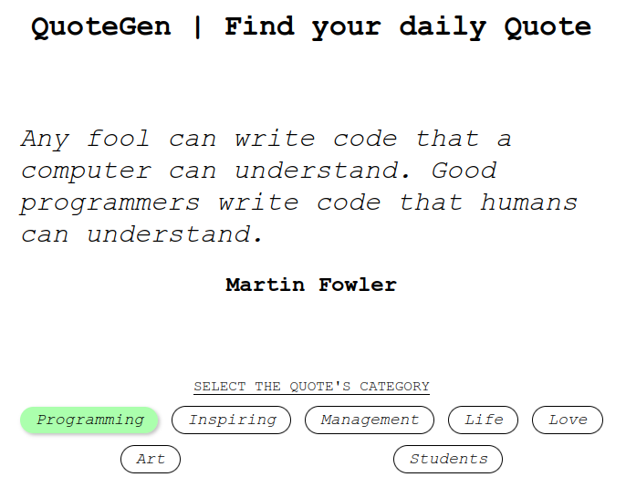

# Comment Slider

A quote selector using HTML, CSS and Vanilla JavaScript. I didn't use any framework due to the project being really small and simple.

## How to use locally

Clone the repository on your local machine. Open the HTML file directly on your browser or run the project using Live Server.

## Screenshot

## About the author

I'm Dario Aladuz, a Full Stack Web Developer. I've been programming for more than 3 years now and currently working on personal projects, and looking for a job position.

### License

MIT License